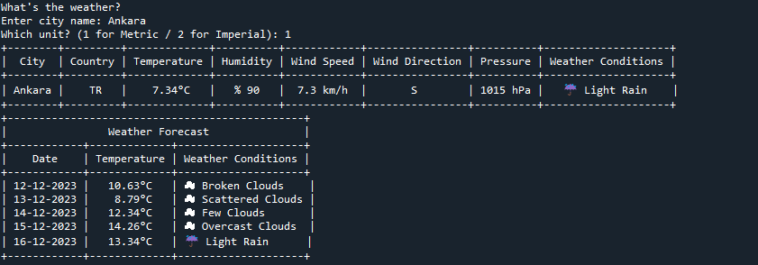
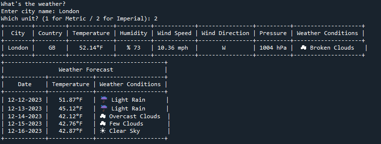
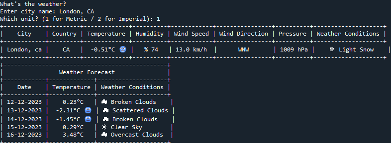

# GetWeath
## Overview
Hello, I am Mert. GetWeath is a standalone project designed to demonstrate the practical use of Python in creating a real-world weather query tool. It allows users to fetch current weather conditions and a five-day forecast for any city. The application is part of my ongoing efforts to enhance my programming skills and understanding of Python.

## Key Features
* Fetch current weather data for any city.
* Get a five-day weather forecast.
* Choose between Metric and Imperial units.
* Display results in a user-friendly tabular format.
* Handle user input and API responses.
## Built With
* Python
* Requests library for API calls.
* Dotenv for environment variable management.
* PrettyTable for formatting the output.
* Datetime for handling date and time.
  
## Installation and Setup
Before running the application, you need to install the required Python libraries. You can install these libraries using pip:

> pip install python-dotenv

> pip install prettytable

You also need to set up an API key from OpenWeatherMap and store it in a .env file:
> api_key=YOUR_API_KEY

## Educational Objectives
This project is designed to practice and showcase the following Python concepts:

* API Integration: Interacting with the OpenWeatherMap API to fetch weather data.
* Environment Variables: Using the dotenv library to manage API keys and sensitive information.
* Data Handling: Processing and manipulating data returned from API requests.
* Conditional Logic: Implementing control flow based on user input and API responses.
* External Libraries: Utilizing requests for API calls, PrettyTable for displaying data, and datetime for date and time manipulation.
  
## How to Run
Run the script from your terminal or command prompt:
python GetWeath.py
Follow the on-screen prompts to enter the city name and choose the unit of measurement.

* Important Note on City Names
When entering city names in the application, please note that some cities might have the same name but be located in different countries. To ensure accuracy in fetching weather data, specify the city name followed by a comma and the country code. For example:

> London,GB for London in the United Kingdom

> London,CA for London in Canada

This notation helps the application to accurately identify the city and fetch the correct weather data.

